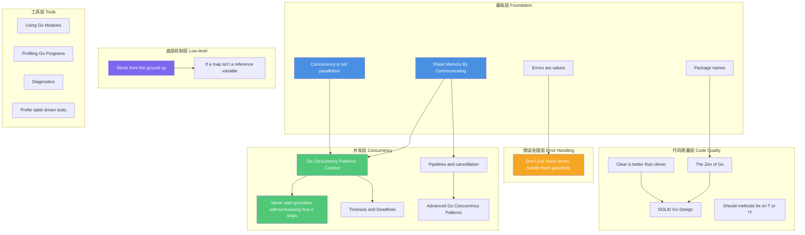

# Go 高级主题系统学习指南

> 基于 [Golang 进阶文章一览](https://www.cyningsun.com/10-15-2020/advanced-golang-article.html) 整理

---

## 第一部分：文章索引与基本信息

### 1. Golang Design Cornerstone（Go 设计基石）

#### 1.1 《Share Memory By Communicating》
- **作者**: Go 官方团队
- **类型**: 设计理念
- **难度**: ⭐⭐ (基础)
- **链接**: https://go.dev/blog/codelab-share

#### 1.2 《Concurrency is not parallelism》
- **作者**: Rob Pike
- **类型**: 概念澄清
- **难度**: ⭐⭐ (基础)
- **链接**: https://go.dev/blog/waza-talk

---

### 2. Concurrency Pattern（并发模式）

#### 2.1 《Go Concurrency Patterns: Context》
- **作者**: Sameer Ajmani
- **类型**: 并发模式
- **难度**: ⭐⭐⭐ (中级)
- **链接**: https://go.dev/blog/context

#### 2.2 《Go Concurrency Patterns: Pipelines and cancellation》
- **作者**: Sameer Ajmani
- **类型**: 并发模式
- **难度**: ⭐⭐⭐ (中级)
- **链接**: https://go.dev/blog/pipelines

#### 2.3 《Go Concurrency Patterns: Timing out, moving on》
- **作者**: Andrew Gerrand
- **类型**: 并发模式
- **难度**: ⭐⭐⭐ (中级)
- **链接**: https://go.dev/blog/go-concurrency-patterns-timing-out-and

#### 2.4 《Advanced Go Concurrency Patterns》
- **作者**: Sameer Ajmani (Google)
- **类型**: 高级并发
- **难度**: ⭐⭐⭐⭐ (高级)
- **链接**: https://go.dev/talks/2013/advconc.slide
- **视频**: [YouTube](https://www.youtube.com/watch?v=QDDwwePbDtw)
- **详细笔记**: [完整笔记](./advanced-go-concurrency-patterns-notes.md)

#### 2.5 《Context isn't for cancellation》
- **作者**: Dave Cheney
- **类型**: 最佳实践
- **难度**: ⭐⭐⭐ (中级)
- **链接**: https://dave.cheney.net/2017/08/20/context-isnt-for-cancellation

#### 2.6 《Never start a goroutine without knowing how it will stop》
- **作者**: Dave Cheney
- **类型**: 最佳实践
- **难度**: ⭐⭐⭐ (中级)
- **链接**: https://dave.cheney.net/2016/12/22/never-start-a-goroutine-without-knowing-how-it-will-stop

#### 2.7 《Rethinking Classical Concurrency Patterns》
- **作者**: Bryan C. Mills
- **类型**: 并发模式重构
- **难度**: ⭐⭐⭐⭐ (高级)
- **链接**: https://go.dev/blog/io2013-talk-concurrency

#### 2.8 《Timeouts and Deadlines》
- **作者**: Dave Cheney
- **类型**: 超时处理
- **难度**: ⭐⭐⭐ (中级)
- **链接**: https://dave.cheney.net/2016/11/18/timeouts-and-deadlines

---

### 3. Error Handling（错误处理）

#### 3.1 《Errors are values》
- **作者**: Rob Pike
- **类型**: 设计理念
- **难度**: ⭐⭐ (基础)
- **链接**: https://go.dev/blog/errors-are-values

#### 3.2 《Don't just check errors, handle them gracefully》
- **作者**: Dave Cheney
- **类型**: 最佳实践
- **难度**: ⭐⭐⭐ (中级)
- **链接**: https://dave.cheney.net/2016/04/27/dont-just-check-errors-handle-them-gracefully

---

### 4. Naming（命名规范）

#### 4.1 《Package names》
- **作者**: Andrew Gerrand
- **类型**: 命名规范
- **难度**: ⭐ (入门)
- **链接**: https://go.dev/blog/package-names

#### 4.2 《Avoid package names like base, util, or common》
- **作者**: Dave Cheney
- **类型**: 命名反模式
- **难度**: ⭐ (入门)
- **链接**: https://dave.cheney.net/2019/01/08/avoid-package-names-like-base-util-or-common

---

### 5. Package Management（包管理）

#### 5.1 《Using Go Modules》
- **作者**: Go 官方团队
- **类型**: 工具使用
- **难度**: ⭐⭐ (基础)
- **链接**: https://go.dev/blog/using-go-modules

---

### 6. Logging（日志）

#### 6.1 《Let's talk about logging》
- **作者**: Dave Cheney
- **类型**: 日志最佳实践
- **难度**: ⭐⭐⭐ (中级)
- **链接**: https://dave.cheney.net/2015/11/05/lets-talk-about-logging

---

### 7. Code Style（代码风格）

#### 7.1 《SOLID Go Design》
- **作者**: Dave Cheney
- **类型**: 设计原则
- **难度**: ⭐⭐⭐ (中级)
- **链接**: https://dave.cheney.net/2016/08/20/solid-go-design

#### 7.2 《Do not fear first class functions》
- **作者**: Dave Cheney
- **类型**: 函数式编程
- **难度**: ⭐⭐⭐ (中级)
- **链接**: https://dave.cheney.net/2016/11/13/do-not-fear-first-class-functions

#### 7.3 《The Zen of Go》
- **作者**: Dave Cheney
- **类型**: 设计哲学
- **难度**: ⭐⭐ (基础)
- **链接**: https://dave.cheney.net/2020/02/23/the-zen-of-go

#### 7.4 《Clear is better than clever》
- **作者**: Dave Cheney
- **类型**: 代码风格
- **难度**: ⭐⭐ (基础)
- **链接**: https://dave.cheney.net/2019/01/27/clear-is-better-than-clever

#### 7.5 《Go, without package scoped variables》
- **作者**: Dave Cheney
- **类型**: 最佳实践
- **难度**: ⭐⭐⭐ (中级)
- **链接**: https://dave.cheney.net/2017/06/11/go-without-package-scoped-variables

#### 7.6 《Should methods be declared on T or *T》
- **作者**: Dave Cheney
- **类型**: 方法设计
- **难度**: ⭐⭐⭐ (中级)
- **链接**: https://dave.cheney.net/2016/03/19/should-methods-be-declared-on-t-or-t

#### 7.7 《Simplicity and collaboration》
- **作者**: Dave Cheney
- **类型**: 团队协作
- **难度**: ⭐⭐ (基础)
- **链接**: https://dave.cheney.net/2017/06/15/simplicity-and-collaboration

---

### 8. Debug&Profile&Diagnostics（调试与性能分析）

#### 8.1 《Profiling Go Programs》
- **作者**: Go 官方团队
- **类型**: 性能分析
- **难度**: ⭐⭐⭐ (中级)
- **链接**: https://go.dev/blog/pprof

#### 8.2 《Diagnostics》
- **作者**: Go 官方团队
- **类型**: 诊断工具
- **难度**: ⭐⭐⭐ (中级)
- **链接**: https://go.dev/doc/diagnostics

#### 8.3 《Stack Traces In Go》
- **作者**: Dave Cheney
- **类型**: 调试技巧
- **难度**: ⭐⭐⭐ (中级)
- **链接**: https://dave.cheney.net/2015/11/29/a-whirlwind-tour-of-gos-runtime-environment-variables

---

### 9. TDD（测试驱动开发）

#### 9.1 《Prefer table driven tests》
- **作者**: Dave Cheney
- **类型**: 测试模式
- **难度**: ⭐⭐ (基础)
- **链接**: https://dave.cheney.net/2019/05/07/prefer-table-driven-tests

---

### 10. Golang Struct（结构体）

#### 10.1 《If a map isn't a reference variable, what is it?》
- **作者**: Dave Cheney
- **类型**: 内存模型
- **难度**: ⭐⭐⭐ (中级)
- **链接**: https://dave.cheney.net/2017/04/30/if-a-map-isnt-a-reference-variable-what-is-it

#### 10.2 《Slices from the ground up》
- **作者**: Dave Cheney
- **类型**: 底层机制
- **难度**: ⭐⭐⭐⭐ (高级)
- **链接**: https://dave.cheney.net/2018/07/12/slices-from-the-ground-up

---

## 第二部分：深度分析

### 主题 1: Golang Design Cornerstone

#### 《Share Memory By Communicating》

**解决的问题**:
- 如何安全地在线程/goroutine 之间共享数据
- 如何避免竞态条件和数据竞争

**前置知识**:
- Go 基础语法
- Channel 基本概念

**能力提升**:
- ✅ 理解 Go 并发哲学："通过通信共享内存，而非通过共享内存通信"
- ✅ 掌握 Channel 作为同步原语的使用
- ✅ 避免使用互斥锁的常见场景

**代码示例**: ✅ 有（Go 官方博客提供）

**实践价值**: ⭐⭐⭐⭐⭐
- **立即应用**: 所有并发场景
- **必读**: 理解 Go 并发设计哲学

---

#### 《Concurrency is not parallelism》

**解决的问题**:
- 并发和并行的概念混淆
- 何时使用并发，何时需要并行

**前置知识**:
- 基础并发概念

**能力提升**:
- ✅ 清晰区分并发（Concurrency）和并行（Parallelism）
- ✅ 理解 Go 的并发模型
- ✅ 正确设计并发程序

**代码示例**: ✅ 有（Rob Pike 的演讲）

**实践价值**: ⭐⭐⭐⭐
- **立即应用**: 设计并发架构时
- **必读**: 建立正确的并发思维

---

### 主题 2: Concurrency Pattern

#### 《Go Concurrency Patterns: Context》

**解决的问题**:
- 如何优雅地取消长时间运行的操作
- 如何在调用链中传递取消信号
- 如何设置超时和截止时间

**前置知识**:
- Go 基础并发
- Channel 使用

**能力提升**:
- ✅ 掌握 `context.Context` 的使用
- ✅ 实现优雅的取消机制
- ✅ 避免 goroutine 泄漏

**代码示例**: ✅ 有（Go 官方博客）

**实践价值**: ⭐⭐⭐⭐⭐
- **立即应用**: 所有涉及超时、取消的场景
- **必读**: 现代 Go 并发编程基础

**在 MCP SDK 中的应用**:
```go
// 当前项目中的使用
func (cs *ClientSession) CallTool(ctx context.Context, params *CallToolParams) (*CallToolResult, error) {
    return handleSend[*CallToolResult](ctx, methodCallTool, newClientRequest(cs, params))
    //                                 ↑ Context 用于取消和超时
}
```

---

#### 《Go Concurrency Patterns: Pipelines and cancellation》

**解决的问题**:
- 如何构建数据处理管道
- 如何在管道中传播取消信号
- 如何优雅地关闭管道

**前置知识**:
- Channel 操作
- Context 使用

**能力提升**:
- ✅ 设计数据流管道
- ✅ 实现扇入/扇出模式
- ✅ 处理管道错误和取消

**代码示例**: ✅ 有（Go 官方博客）

**实践价值**: ⭐⭐⭐⭐
- **立即应用**: 数据处理、ETL 场景
- **必读**: 理解 Go 并发模式

---

#### 《Never start a goroutine without knowing how it will stop》

**解决的问题**:
- Goroutine 泄漏问题
- 如何确保所有 goroutine 都能正确退出
- 如何追踪 goroutine 生命周期

**前置知识**:
- Goroutine 基础
- Channel 和 Context

**能力提升**:
- ✅ 避免 goroutine 泄漏
- ✅ 设计可追踪的并发程序
- ✅ 实现优雅关闭

**代码示例**: ✅ 有（Dave Cheney 博客）

**实践价值**: ⭐⭐⭐⭐⭐
- **立即应用**: 所有使用 goroutine 的地方
- **必读**: 生产环境必读

**在 MCP SDK 中的应用**:
```go
// 当前项目中的实践
go func() {
    dec := json.NewDecoder(rwc)
    for {
        // ... 读取逻辑
        select {
        case incoming <- msgOrErr{msg: raw, err: err}:
        case <-closed:  // ← 明确的退出机制
            return
        }
    }
}()
```

---

#### 《Advanced Go Concurrency Patterns》

**解决的问题**:
- **核心问题**: "It's easy to go, but how to stop?" - 如何优雅地停止 goroutines
- 长时间运行程序的资源清理
- 处理通信、周期性事件和取消
- 避免 goroutine 泄漏和死锁

**前置知识**:
- Go 基础并发（goroutines 和 channels）
- `select` 语句基本用法
- 理解 Go 并发哲学

**能力提升**:
- ✅ 掌握 **for-select 循环**模式（并发程序核心控制结构）
- ✅ 掌握 **Service Channel + Reply Channel** 模式（优雅关闭机制）
- ✅ 掌握 **Nil Channel 技巧**（条件性启用 select case）
- ✅ 掌握 **异步操作模式**（避免阻塞主循环）
- ✅ 设计响应式、可清理的并发程序

**核心模式**:
1. **for-select 循环**: 处理多个通信操作的核心结构
2. **Service Channel**: `chan chan error` 实现请求-回复模式
3. **Nil Channel**: 动态启用/禁用 select case
4. **异步 Fetch**: 使用通道跟踪异步操作状态

**代码示例**: ✅ 有（完整 RSS Feed Reader 实现）

**实践价值**: ⭐⭐⭐⭐⭐
- **立即应用**: 所有需要优雅关闭的并发场景
- **必读**: 深入理解 Go 并发编程精髓
- **在 MCP SDK 中的应用**: Transport 层消息读取、资源订阅管理

**详细笔记**: 参见 [Advanced Go Concurrency Patterns 完整笔记](./advanced-go-concurrency-patterns-notes.md)

---

### 主题 3: Error Handling

#### 《Errors are values》

**解决的问题**:
- 错误处理的正确方式
- 避免过度使用异常机制
- 错误作为值的设计哲学

**前置知识**:
- Go 错误处理基础

**能力提升**:
- ✅ 理解 Go 错误处理哲学
- ✅ 设计清晰的错误处理流程
- ✅ 避免错误处理反模式

**代码示例**: ✅ 有（Rob Pike 博客）

**实践价值**: ⭐⭐⭐⭐⭐
- **立即应用**: 所有错误处理场景
- **必读**: Go 错误处理基础

**在 MCP SDK 中的应用**:
```go
// 当前项目中的实践
func (c *Client) Connect(ctx context.Context, t Transport, _ *ClientSessionOptions) (*ClientSession, error) {
    cs, err := connect(ctx, t, c, (*clientSessionState)(nil), nil)
    if err != nil {
        return nil, err  // ← 错误作为值返回
    }
    // ...
}
```

---

#### 《Don't just check errors, handle them gracefully》

**解决的问题**:
- 如何包装错误以保留上下文
- 如何创建有意义的错误类型
- 错误处理的层次化

**前置知识**:
- Go 错误处理基础
- `fmt.Errorf` 和 `%w` 动词

**能力提升**:
- ✅ 使用 `errors.Wrap` 和 `fmt.Errorf` 包装错误
- ✅ 创建自定义错误类型
- ✅ 实现错误检查（`errors.Is`, `errors.As`）

**代码示例**: ✅ 有（Dave Cheney 博客）

**实践价值**: ⭐⭐⭐⭐⭐
- **立即应用**: 所有错误处理场景
- **必读**: 生产环境错误处理

**在 MCP SDK 中的应用**:
```go
// 当前项目中的实践
return fmt.Errorf("%w: calling %q: %v", ErrConnectionClosed, method, err)
//     ↑ 使用 %w 包装错误，支持 errors.Is()
```

---

### 主题 4: Naming

#### 《Package names》

**解决的问题**:
- 如何为包选择合适的名称
- 包命名的最佳实践
- 避免命名冲突

**前置知识**:
- Go 包系统基础

**能力提升**:
- ✅ 掌握包命名规范
- ✅ 设计清晰的包结构
- ✅ 提高代码可读性

**代码示例**: ⚠️ 示例较少

**实践价值**: ⭐⭐⭐
- **立即应用**: 新项目包设计
- **必读**: 代码规范基础

---

#### 《Avoid package names like base, util, or common》

**解决的问题**:
- 避免使用模糊的包名
- 包名应该表达具体职责
- 提高包的可用性

**前置知识**:
- Go 包系统

**能力提升**:
- ✅ 识别包命名反模式
- ✅ 设计职责清晰的包
- ✅ 提高代码可维护性

**代码示例**: ⚠️ 示例较少

**实践价值**: ⭐⭐⭐
- **立即应用**: 重构现有项目
- **必读**: 代码质量提升

---

### 主题 5: Package Management

#### 《Using Go Modules》

**解决的问题**:
- Go Modules 的使用方法
- 依赖管理最佳实践
- 版本控制策略

**前置知识**:
- Go 基础
- 版本控制概念

**能力提升**:
- ✅ 掌握 Go Modules 使用
- ✅ 管理项目依赖
- ✅ 处理版本冲突

**代码示例**: ✅ 有（Go 官方博客）

**实践价值**: ⭐⭐⭐⭐⭐
- **立即应用**: 所有 Go 项目
- **必读**: 现代 Go 开发基础

---

### 主题 6: Logging

#### 《Let's talk about logging》

**解决的问题**:
- 日志记录的最佳实践
- 结构化日志设计
- 日志级别和格式

**前置知识**:
- Go 基础
- 日志概念

**能力提升**:
- ✅ 设计结构化日志
- ✅ 选择合适的日志级别
- ✅ 实现日志轮转和聚合

**代码示例**: ✅ 有（Dave Cheney 博客）

**实践价值**: ⭐⭐⭐⭐
- **立即应用**: 所有生产项目
- **必读**: 可观测性基础

**在 MCP SDK 中的应用**:
```go
// 当前项目中的实践
s.opts.Logger.Info("server session connected", "session_id", ss.ID())
//              ↑ 结构化日志
```

---

### 主题 7: Code Style

#### 《SOLID Go Design》

**解决的问题**:
- 如何在 Go 中应用 SOLID 原则
- Go 特有的设计模式
- 接口设计最佳实践

**前置知识**:
- SOLID 原则基础
- Go 接口使用

**能力提升**:
- ✅ 在 Go 中应用 SOLID 原则
- ✅ 设计清晰的接口
- ✅ 提高代码可维护性

**代码示例**: ✅ 有（Dave Cheney 博客）

**实践价值**: ⭐⭐⭐⭐
- **立即应用**: 架构设计
- **必读**: 设计原则理解

**在 MCP SDK 中的应用**:
```go
// 当前项目中的实践 - 依赖倒置原则
type Transport interface {  // ← 接口定义
    Connect(ctx context.Context) (Connection, error)
}

// 多种实现
type StdioTransport struct{}  // ← 具体实现
type IOTransport struct{}    // ← 具体实现
```

---

#### 《The Zen of Go》

**解决的问题**:
- Go 的设计哲学
- 简洁性 vs 功能性的平衡
- Go 社区的最佳实践

**前置知识**:
- Go 基础使用经验

**能力提升**:
- ✅ 理解 Go 设计哲学
- ✅ 编写符合 Go 风格的代码
- ✅ 提高代码可读性

**代码示例**: ⚠️ 主要是理念

**实践价值**: ⭐⭐⭐⭐
- **立即应用**: 代码审查和重构
- **必读**: 建立 Go 编程思维

---

#### 《Should methods be declared on T or *T》

**解决的问题**:
- 方法接收者的选择
- 值接收者 vs 指针接收者
- 性能考虑

**前置知识**:
- Go 方法基础
- 指针概念

**能力提升**:
- ✅ 正确选择方法接收者
- ✅ 理解值语义和引用语义
- ✅ 优化方法调用性能

**代码示例**: ✅ 有（Dave Cheney 博客）

**实践价值**: ⭐⭐⭐⭐
- **立即应用**: 所有方法设计
- **必读**: Go 方法设计基础

---

### 主题 8: Debug&Profile&Diagnostics

#### 《Profiling Go Programs》

**解决的问题**:
- 如何使用 pprof 进行性能分析
- CPU 和内存性能优化
- 性能瓶颈定位

**前置知识**:
- Go 基础
- 性能分析概念

**能力提升**:
- ✅ 使用 pprof 工具
- ✅ 分析 CPU 和内存使用
- ✅ 定位性能瓶颈

**代码示例**: ✅ 有（Go 官方博客）

**实践价值**: ⭐⭐⭐⭐⭐
- **立即应用**: 性能优化场景
- **必读**: 性能调优必备

---

#### 《Diagnostics》

**解决的问题**:
- Go 程序的诊断工具
- 运行时信息获取
- 问题排查技巧

**前置知识**:
- Go 运行时基础

**能力提升**:
- ✅ 使用诊断工具
- ✅ 分析运行时信息
- ✅ 快速定位问题

**代码示例**: ✅ 有（Go 官方文档）

**实践价值**: ⭐⭐⭐⭐
- **立即应用**: 生产问题排查
- **必读**: 运维和调试

---

### 主题 9: TDD

#### 《Prefer table driven tests》

**解决的问题**:
- 如何编写清晰的测试
- 表驱动测试模式
- 测试代码组织

**前置知识**:
- Go 测试基础

**能力提升**:
- ✅ 编写表驱动测试
- ✅ 提高测试覆盖率
- ✅ 组织测试代码

**代码示例**: ✅ 有（Dave Cheney 博客）

**实践价值**: ⭐⭐⭐⭐
- **立即应用**: 所有测试场景
- **必读**: Go 测试最佳实践

---

### 主题 10: Golang Struct

#### 《Slices from the ground up》

**解决的问题**:
- Slice 的底层实现
- Slice 的内存布局
- Slice 操作的性能影响

**前置知识**:
- Go 基础
- 内存模型概念

**能力提升**:
- ✅ 深入理解 Slice 机制
- ✅ 优化 Slice 使用
- ✅ 避免 Slice 相关 bug

**代码示例**: ✅ 有（Dave Cheney 博客）

**实践价值**: ⭐⭐⭐⭐⭐
- **立即应用**: 高性能场景
- **必读**: 理解 Go 底层机制

---

## 第三部分：实践指导

### 立即应用到项目的文章（优先级排序）

#### 🔥 最高优先级（立即学习）

1. **《Never start a goroutine without knowing how it will stop》**
   - **原因**: 防止 goroutine 泄漏，生产环境必须
   - **应用场景**: 所有使用 goroutine 的代码
   - **预计收益**: 避免 OOM，提高稳定性

2. **《Go Concurrency Patterns: Context》**
   - **原因**: Context 是现代 Go 并发编程基础
   - **应用场景**: 所有涉及超时、取消的操作
   - **预计收益**: 优雅的取消机制，避免资源泄漏

3. **《Don't just check errors, handle them gracefully》**
   - **原因**: 错误处理是 Go 的核心
   - **应用场景**: 所有错误处理代码
   - **预计收益**: 更好的错误追踪和调试

4. **《Errors are values》**
   - **原因**: 理解 Go 错误处理哲学
   - **应用场景**: 错误处理设计
   - **预计收益**: 正确的错误处理思维

#### ⭐ 高优先级（近期学习）

5. **《Go Concurrency Patterns: Pipelines and cancellation》**
   - **原因**: 数据处理管道模式
   - **应用场景**: 数据流处理
   - **预计收益**: 设计清晰的数据流

6. **《Let's talk about logging》**
   - **原因**: 可观测性基础
   - **应用场景**: 所有生产代码
   - **预计收益**: 更好的问题排查能力

7. **《Profiling Go Programs》**
   - **原因**: 性能优化必备
   - **应用场景**: 性能瓶颈分析
   - **预计收益**: 快速定位性能问题

8. **《Prefer table driven tests》**
   - **原因**: 提高测试质量
   - **应用场景**: 所有测试代码
   - **预计收益**: 更清晰的测试，更高覆盖率

#### 📚 中优先级（系统学习）

9. **《SOLID Go Design》**
10. **《The Zen of Go》**
11. **《Should methods be declared on T or *T》**
12. **《Slices from the ground up》**

---

### 理解 Go 底层机制必读文章

#### 核心必读（理解 Go 本质）

1. **《Share Memory By Communicating》**
   - **重要性**: ⭐⭐⭐⭐⭐
   - **原因**: Go 并发设计的核心哲学
   - **前置**: Go 基础

2. **《Concurrency is not parallelism》**
   - **重要性**: ⭐⭐⭐⭐⭐
   - **原因**: 建立正确的并发思维
   - **前置**: 基础并发概念

3. **《Slices from the ground up》**
   - **重要性**: ⭐⭐⭐⭐⭐
   - **原因**: 理解 Go 最常用的数据结构
   - **前置**: Go 基础，内存模型

4. **《If a map isn't a reference variable, what is it?》**
   - **重要性**: ⭐⭐⭐⭐
   - **原因**: 理解 Go 的内存模型
   - **前置**: 指针和引用概念

5. **《Advanced Go Concurrency Patterns》**
   - **重要性**: ⭐⭐⭐⭐
   - **原因**: 深入理解 Go 并发机制
   - **前置**: 基础并发模式

---

### 推荐学习路径（从易到难）

#### 阶段 1: 基础建立（1-2周）

**目标**: 建立正确的 Go 编程思维

1. **《Share Memory By Communicating》** ⭐⭐
   - 理解 Go 并发哲学
   - 实践: 用 Channel 替代 Mutex

2. **《Concurrency is not parallelism》** ⭐⭐
   - 区分并发和并行
   - 实践: 分析现有代码的并发模式

3. **《Errors are values》** ⭐⭐
   - 理解错误处理哲学
   - 实践: 重构错误处理代码

4. **《Package names》** ⭐
   - 包命名规范
   - 实践: 检查项目包命名

#### 阶段 2: 并发进阶（2-3周）

**目标**: 掌握 Go 并发编程

5. **《Go Concurrency Patterns: Context》** ⭐⭐⭐
   - 掌握 Context 使用
   - 实践: 为所有长时间操作添加 Context

6. **《Never start a goroutine without knowing how it will stop》** ⭐⭐⭐
   - 防止 Goroutine 泄漏
   - 实践: 审查所有 goroutine 的退出机制

7. **《Go Concurrency Patterns: Pipelines and cancellation》** ⭐⭐⭐
   - 管道模式
   - 实践: 实现一个数据处理管道

8. **《Timeouts and Deadlines》** ⭐⭐⭐
   - 超时处理
   - 实践: 为所有 I/O 操作添加超时

#### 阶段 3: 错误处理与代码质量（1-2周）

**目标**: 提高代码质量

9. **《Don't just check errors, handle them gracefully》** ⭐⭐⭐
   - 错误包装和检查
   - 实践: 使用 `errors.Is` 和 `errors.As`

10. **《Prefer table driven tests》** ⭐⭐
    - 表驱动测试
    - 实践: 重构现有测试

11. **《The Zen of Go》** ⭐⭐
    - Go 设计哲学
    - 实践: 代码审查时应用原则

12. **《Clear is better than clever》** ⭐⭐
    - 代码可读性
    - 实践: 重构复杂代码

#### 阶段 4: 设计原则（2-3周）

**目标**: 掌握 Go 设计模式

13. **《SOLID Go Design》** ⭐⭐⭐
    - SOLID 原则在 Go 中的应用
    - 实践: 重构现有代码应用 SOLID

14. **《Should methods be declared on T or *T》** ⭐⭐⭐
    - 方法接收者选择
    - 实践: 审查所有方法的接收者

15. **《Do not fear first class functions》** ⭐⭐⭐
    - 函数式编程
    - 实践: 使用函数作为参数

16. **《Go, without package scoped variables》** ⭐⭐⭐
    - 依赖注入
    - 实践: 移除包级变量

#### 阶段 5: 高级主题（3-4周）

**目标**: 深入理解 Go 机制

17. **《Slices from the ground up》** ⭐⭐⭐⭐
    - Slice 底层机制
    - 实践: 优化 Slice 使用

18. **《Advanced Go Concurrency Patterns》** ⭐⭐⭐⭐
    - 高级并发模式
    - 实践: 实现复杂并发场景

19. **《Rethinking Classical Concurrency Patterns》** ⭐⭐⭐⭐
    - 并发模式重构
    - 实践: 重构现有并发代码

20. **《Profiling Go Programs》** ⭐⭐⭐
    - 性能分析
    - 实践: 分析并优化一个程序

#### 阶段 6: 工具与最佳实践（1-2周）

**目标**: 掌握开发工具链

21. **《Using Go Modules》** ⭐⭐
    - 依赖管理
    - 实践: 迁移到 Go Modules

22. **《Let's talk about logging》** ⭐⭐⭐
    - 日志最佳实践
    - 实践: 实现结构化日志

23. **《Diagnostics》** ⭐⭐⭐
    - 诊断工具
    - 实践: 使用诊断工具排查问题

24. **《Stack Traces In Go》** ⭐⭐⭐
    - 堆栈跟踪
    - 实践: 分析 panic 堆栈

---

## 第四部分：知识图谱

### 4.1 主题依赖关系图



### 4.2 详细知识依赖关系

#### 并发主题依赖链

```
基础概念
  ├─ Share Memory By Communicating (基础)
  │   └─ Go Concurrency Patterns: Context (应用)
  │       ├─ Never start goroutine without knowing how it stops (实践)
  │       ├─ Pipelines and cancellation (模式)
  │       │   └─ Advanced Go Concurrency Patterns (高级)
  │       └─ Timeouts and Deadlines (实践)
  │
  └─ Concurrency is not parallelism (概念)
      └─ Rethinking Classical Concurrency Patterns (重构)
```

#### 错误处理依赖链

```
Errors are values (哲学)
  └─ Don't just check errors, handle them gracefully (实践)
      ├─ 错误包装 (fmt.Errorf with %w)
      ├─ 错误检查 (errors.Is, errors.As)
      └─ 自定义错误类型
```

#### 代码质量依赖链

```
Package names (基础)
  └─ The Zen of Go (哲学)
      ├─ Clear is better than clever (风格)
      ├─ SOLID Go Design (原则)
      │   ├─ Should methods be on T or *T (细节)
      │   └─ Do not fear first class functions (模式)
      └─ Go, without package scoped variables (实践)
```

#### 底层机制依赖链

```
Slices from the ground up (深入)
  └─ If a map isn't a reference variable (内存模型)
      └─ 理解 Go 值语义和引用语义
```

### 4.3 学习依赖关系

#### 必须先学（无依赖）

1. **《Share Memory By Communicating》** - Go 并发基础
2. **《Concurrency is not parallelism》** - 概念澄清
3. **《Errors are values》** - 错误处理基础
4. **《Package names》** - 命名规范

#### 依赖基础层

**并发模式系列**:
- 依赖: 《Share Memory By Communicating》, 《Concurrency is not parallelism》
- 顺序: Context → Pipelines → Advanced Patterns

**错误处理进阶**:
- 依赖: 《Errors are values》
- 顺序: Errors are values → Don't just check errors

#### 依赖并发层

**高级并发**:
- 依赖: 基础并发模式
- 顺序: Context → Advanced Patterns → Rethinking Patterns

#### 独立主题（可并行学习）

- **代码风格**: The Zen of Go, SOLID Go Design
- **底层机制**: Slices from the ground up, Map reference
- **工具使用**: Go Modules, Profiling, Diagnostics

---

## 第五部分：针对 MCP SDK 项目的学习建议

### 5.1 项目代码分析

基于对 MCP SDK 代码的分析，以下是具体的学习建议：

#### 已应用的优秀实践

1. **Context 使用** ✅
   - 所有方法都接受 `context.Context`
   - 支持取消和超时
   - **相关文章**: 《Go Concurrency Patterns: Context》

2. **接口设计** ✅
   - 清晰的接口抽象
   - 依赖倒置原则
   - **相关文章**: 《SOLID Go Design》

3. **错误处理** ✅
   - 使用 `%w` 包装错误
   - 自定义错误类型
   - **相关文章**: 《Don't just check errors, handle them gracefully》

4. **泛型编程** ✅
   - 充分利用 Go 1.18+ 泛型
   - 类型安全的代码复用
   - **相关文章**: 《The Zen of Go》- 简洁性

#### 可改进的领域

1. **Goroutine 生命周期管理** ⚠️
   ```go
   // 当前代码 (transport.go:373)
   go func() {
       dec := json.NewDecoder(rwc)
       for {
           // ... 读取逻辑
           select {
           case incoming <- msgOrErr{msg: raw, err: err}:
           case <-closed:  // ← 有退出机制，但可以更明确
               return
           }
       }
   }()
   ```
   - **建议学习**: 《Never start a goroutine without knowing how it will stop》
   - **改进方向**: 
     - 添加 goroutine 追踪
     - 明确的关闭信号
     - 超时保护

2. **日志统一性** ⚠️
   ```go
   // 当前: 部分使用 slog，部分使用 log.Printf
   s.opts.Logger.Info("server session connected", "session_id", ss.ID())
   log.Printf("jsonrpc2 error: %v", err)  // ← 可以统一
   ```
   - **建议学习**: 《Let's talk about logging》
   - **改进方向**: 统一使用结构化日志

3. **性能分析** ⚠️
   - **当前**: 缺少性能监控
   - **建议学习**: 《Profiling Go Programs》
   - **改进方向**: 添加可选的性能监控接口

### 5.2 具体学习计划（针对 MCP SDK）

#### 第1周：并发安全强化

**学习目标**: 确保所有并发代码安全可靠

**必读文章**:
1. 《Never start a goroutine without knowing how it will stop》
2. 《Go Concurrency Patterns: Context》
3. 《Timeouts and Deadlines》

**实践任务**:
- [ ] 审查所有 goroutine 的退出机制
- [ ] 为所有 I/O 操作添加超时
- [ ] 实现 goroutine 追踪机制

**代码改进示例**:
```go
// 改进前
go func() {
    // 读取循环
}()

// 改进后
func (c *ioConn) startReadLoop(ctx context.Context) {
    go func() {
        defer c.readLoopDone.Done()  // ← 明确的完成信号
        for {
            select {
            case <-ctx.Done():
                return  // ← 明确的退出
            case <-c.closed:
                return
            case incoming <- msgOrErr{msg: raw, err: err}:
                // ...
            }
        }
    }()
}
```

#### 第2周：错误处理优化

**学习目标**: 统一错误处理，提高可调试性

**必读文章**:
1. 《Errors are values》
2. 《Don't just check errors, handle them gracefully》

**实践任务**:
- [ ] 统一使用 `fmt.Errorf` 和 `%w`
- [ ] 创建错误类型层次结构
- [ ] 实现错误检查工具函数

**代码改进示例**:
```go
// 改进前
if err != nil {
    return nil, err
}

// 改进后
if err != nil {
    return nil, fmt.Errorf("connecting to transport: %w", err)
    //              ↑ 添加上下文信息
}
```

#### 第3周：代码质量提升

**学习目标**: 应用 Go 设计原则

**必读文章**:
1. 《The Zen of Go》
2. 《SOLID Go Design》
3. 《Clear is better than clever》

**实践任务**:
- [ ] 重构复杂函数
- [ ] 应用 SOLID 原则
- [ ] 提高代码可读性

#### 第4周：性能优化

**学习目标**: 掌握性能分析工具

**必读文章**:
1. 《Profiling Go Programs》
2. 《Slices from the ground up》

**实践任务**:
- [ ] 使用 pprof 分析性能
- [ ] 优化热点代码
- [ ] 添加性能监控

### 5.3 学习成果验证

#### 学习检查清单

**并发安全**:
- [ ] 所有 goroutine 都有明确的退出机制
- [ ] 所有长时间操作都有超时
- [ ] 没有 goroutine 泄漏风险

**错误处理**:
- [ ] 所有错误都有上下文信息
- [ ] 使用 `errors.Is` 和 `errors.As` 检查错误
- [ ] 错误类型层次清晰

**代码质量**:
- [ ] 遵循 SOLID 原则
- [ ] 代码简洁清晰
- [ ] 接口设计合理

**性能**:
- [ ] 使用 pprof 分析过性能
- [ ] 优化了热点代码
- [ ] 有性能监控机制

---

## 第六部分：学习资源汇总

### 当前项目已应用的最佳实践

#### ✅ 已应用

1. **Context 使用** ⭐⭐⭐⭐⭐
   ```go
   func (cs *ClientSession) CallTool(ctx context.Context, params *CallToolParams) (*CallToolResult, error)
   ```
   - 所有方法都接受 `context.Context`
   - 支持取消和超时

2. **错误处理** ⭐⭐⭐⭐
   ```go
   return fmt.Errorf("%w: calling %q: %v", ErrConnectionClosed, method, err)
   ```
   - 使用 `%w` 包装错误
   - 自定义错误类型

3. **接口设计** ⭐⭐⭐⭐⭐
   ```go
   type Transport interface {
       Connect(ctx context.Context) (Connection, error)
   }
   ```
   - 遵循依赖倒置原则
   - 清晰的接口抽象

4. **结构化日志** ⭐⭐⭐
   ```go
   s.opts.Logger.Info("server session connected", "session_id", ss.ID())
   ```
   - 使用 `slog` 结构化日志

#### ⚠️ 可改进

1. **Goroutine 生命周期管理**
   - **当前**: 有退出机制，但可以更明确
   - **建议**: 深入学习《Never start a goroutine without knowing how it will stop》

2. **错误处理统一性**
   - **当前**: 部分使用 `log.Printf`
   - **建议**: 深入学习《Don't just check errors, handle them gracefully》

3. **性能分析**
   - **当前**: 缺少性能分析
   - **建议**: 学习《Profiling Go Programs》，添加性能监控

---

## 第六部分：学习资源汇总

### 6.1 官方资源

- **Go 官方博客**: https://go.dev/blog
- **Go 官方文档**: https://go.dev/doc
- **Go 官方 Wiki**: https://github.com/golang/go/wiki

### 社区资源

- **Gopher Academy Blog**: https://blog.gopheracademy.com
- **Dave Cheney 博客**: https://dave.cheney.net
- **Golang Talks**: https://go.dev/talks

### 6.2 推荐阅读顺序（针对 MCP SDK 开发者）

#### 第1周：并发基础
1. Share Memory By Communicating
2. Concurrency is not parallelism
3. Go Concurrency Patterns: Context
4. Never start a goroutine without knowing how it will stop

#### 第2周：错误处理
5. Errors are values
6. Don't just check errors, handle them gracefully

#### 第3周：代码质量
7. The Zen of Go
8. SOLID Go Design
9. Should methods be on T or *T

#### 第4周：底层机制
10. Slices from the ground up
11. If a map isn't a reference variable

#### 第5周：工具与实践
12. Profiling Go Programs
13. Prefer table driven tests
14. Let's talk about logging

### 6.3 快速参考表

| 文章主题 | 难度 | 学习时间 | 实践价值 | 必读程度 |
|---------|------|---------|---------|---------|
| Share Memory By Communicating | ⭐⭐ | 30分钟 | ⭐⭐⭐⭐⭐ | 🔥 必读 |
| Concurrency is not parallelism | ⭐⭐ | 20分钟 | ⭐⭐⭐⭐ | 🔥 必读 |
| Go Concurrency Patterns: Context | ⭐⭐⭐ | 1小时 | ⭐⭐⭐⭐⭐ | 🔥 必读 |
| Never start goroutine... | ⭐⭐⭐ | 45分钟 | ⭐⭐⭐⭐⭐ | 🔥 必读 |
| Errors are values | ⭐⭐ | 30分钟 | ⭐⭐⭐⭐⭐ | 🔥 必读 |
| Don't just check errors... | ⭐⭐⭐ | 1小时 | ⭐⭐⭐⭐⭐ | 🔥 必读 |
| SOLID Go Design | ⭐⭐⭐ | 1.5小时 | ⭐⭐⭐⭐ | ⭐ 推荐 |
| The Zen of Go | ⭐⭐ | 45分钟 | ⭐⭐⭐⭐ | ⭐ 推荐 |
| Slices from the ground up | ⭐⭐⭐⭐ | 2小时 | ⭐⭐⭐⭐⭐ | ⭐ 推荐 |
| Profiling Go Programs | ⭐⭐⭐ | 1.5小时 | ⭐⭐⭐⭐ | ⭐ 推荐 |

---

## 第七部分：学习总结

这个文章集合涵盖了 Go 高级编程的**核心主题**，从设计哲学到具体实践，从基础概念到高级模式。

**学习价值**: ⭐⭐⭐⭐⭐

**建议学习方式**:
1. **按阶段学习**: 遵循推荐的学习路径
2. **结合实践**: 每学一篇文章，立即在项目中应用
3. **反复阅读**: 经典文章值得多次阅读
4. **代码实践**: 阅读后一定要写代码验证

**预期收获**:
- ✅ 建立正确的 Go 编程思维
- ✅ 掌握 Go 并发编程模式
- ✅ 理解 Go 底层机制
- ✅ 提高代码质量和可维护性
- ✅ 掌握性能优化技巧

---

**开始学习的最佳时机就是现在！** 🚀

